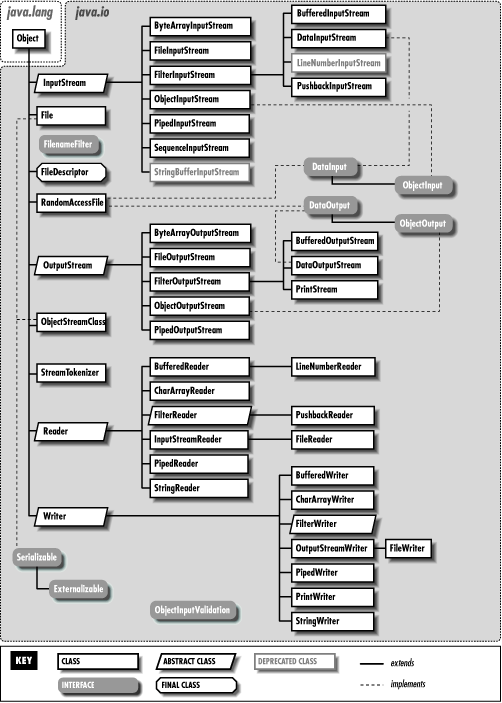

<samp>

### Today I Learned in Java ...

<details>
<summary>Jump to Day</summary>
<a href="#day-00-">00</a> •
<a href="#day-01-">01</a> •
<a href="#day-02-">02</a> •
<a href="#day-03-">03</a> •
<a href="#day-04-">04</a> •
<a href="#day-05-">05</a> •
<a href="#day-06-">06</a> •
<a href="#day-07-">07</a> •
<a href="#day-08-">08</a> •
<a href="#day-09-">09</a> •
<a href="#day-10-">10</a> •
<a href="#day-11-">11</a> •
<a href="#day-12-">12</a> •
<a href="#day-13-">13</a> •
<a href="#day-14-">14</a> •
<a href="#day-15-">15</a> •
<a href="#day-16-">16</a> •
<a href="#day-17-">17</a> •
<a href="#day-18-">18</a> •
<a href="#day-19-">19</a> •
<a href="#day-20-">20</a> •
<a href="#day-21-">21</a> •
<a href="#day-22-">22</a> •
<a href="#day-23-">23</a> •
<a href="#day-24-">24</a> •
<a href="#day-25-">25</a> •
<a href="#day-26-">26</a> •
<a href="#day-27-">27</a> •
<a href="#day-28-">28</a> •
<a href="#day-29-">29</a> •
<a href="#day-30-">30</a> •
<a href="#day-31-">31</a> •
<a href="#day-32-">32</a> •
<a href="#day-33-">33</a> •
<a href="#day-34-">34</a> •
<a href="#day-35-">35</a> •
<a href="#day-36-">36</a> •
<a href="#day-37-">37</a> •
<a href="#day-38-">38</a>
</details>

###### Day 00 [↑](#today-i-learned-in-java- "Back to Top")
- everything is always passed by value.
  - in case of primitive argument, the value is the primitive.
  - in case of object reference argument, the value is the memory address.
- there can be more than one class defined in a file but only one of them can be public.
- if there are multiple classes defined in a single file, then compiling the file will lead to those many `.class` files and they will have names of the corresponding classes.
- the class name and the file name can be different unless it's a public class.
- `>>` is right shift operator.
- `>>>` is unsigned right shift operator.
- multiple `.class` files can be archived into one `.jar` file by running `jar cvf archive.jar c1.class c2.class`.
- `javap` can be used to view the generated Java bytecode, `javap -c HelloWorld.class`.
###### Day 01 [↑](#today-i-learned-in-java- "Back to Top")
- if there is a class which uses other classes, then compiling that class will lead to compilation of all the classes it uses, as the compiler can't really know whether it is valid Java code without doing a depth first compilation first.
- compiling the class that contains `main()` will lead to compilation of the whole project, as it is the entry point.
- the compiled `.class` files need not be present in the current directory for a program to run, provided the classpath(s) is/are mentioned by using the `-cp` flag. By default, the classpath is set to current directory only.
- the class loader will look for `.class` files in the classpath during runtime.
- the `-cp` flag can also be used during compile time to let compiler know where the classes are present.
- a `.jar` file can also be a classpath i.e., the `-cp` flag may contain both directories as well as files.
- multiple classpaths can be separated by using <kbd>:</kbd> in Linux and <kbd>;</kbd> in Windows.
###### Day 02 [↑](#today-i-learned-in-java- "Back to Top")
- once the type of a variable is set it can not be changed later as Java is a _statically typed language_.
- if the variable type is a class, then the variable will be an object reference.
- there are 3 types of variables in Java:
  - **local variables**: declared in methods, constructors or blocks.
  - **instance variables**: declared in a class but outside any methods, constructors or blocks.
  - **class/static variables**: declared with the `static` keyword in a class but outside any methods, constructors or blocks. 
- _local variables_ must be initialized with a value before they are used.
###### Day 03 [↑](#today-i-learned-in-java- "Back to Top")
- `String` objects are immutable i.e., we cannot change the object itself, but we can change the reference to the object.
- `StringBuilder` and `StringBuffer` objects are mutable i.e, they can be used for dynamic string manipulation.
- in an expression if either operand in `+` is a `String` object, then Java converts the other operand to a `String` and creates a new `String` object by concatenating both operands.
- for `String`, each time a string is concatenated, a new object is created and it's the main reason why it's not recommended for cases where a lot of string manipulation is needed, instead using a `StringBuilder` or `StringBuffer` will be more efficient.
- operator overloading is not possible. Note that _string concatenation operator_ `+` is not an overloaded operator.
- the _string concatenation operator_ is just syntactic sugar, it is actually implemented through the use of the `StringBuilder` or `StringBuffer` classes' `append()` method.
- the compiler automatically converts an expression with _string concatenation operator_ into a series of calls to the `append()` method.
> ```java
> String s1 = "Hello";
> String s2 = "World";
> String s3 = s1 + " " + s2;
> ```
> is equivalent to:
> ```java
> String s1 = "Hello";
> String s2 = "World";
> StringBuilder sb = new StringBuilder();
> sb.append(s1).append(" ").append(s2);
> String s3 = sb.toString();
> ```
###### Day 04 [↑](#today-i-learned-in-java- "Back to Top")
- array and class variables are pointers/object references.
- a default initial value is assigned to each element of a newly allocated array if no initial value is specified. For numerical types it is `0`, for boolean it is `false` and for any pointer/object reference it is `null`.
- 2D arrays need not be rectangular, each row can be of different length. Helpful for symmetric matrices.
> ```java
> int[][] A = new int[3][4];  // rectangular
>
> int[][] B;                  // not rectangular
> B = new int[3][];
> B[0] = new int[1];
> B[1] = new int[2];
> B[2] = new int[5];
> ```
- we can copy an array using the `arraycopy` function. Like the output function `println`, `arraycopy` is provided in `java.lang.System`, so we must use the name `System.arraycopy`. The function has five parameters:
  - _src_: the source array
  - _srcPos_: the starting position in the source array
  - _dst_: the destination array
  - _dstPos_: the starting position in the destination array
  - _count_: number of values to copy
> ```java
> // to shift the values in an array:
> int[] A = {0, 1, 2, 3, 4};
> System.arraycopy(A, 0, A, 1, 4);
> ```
###### Day 05 [↑](#today-i-learned-in-java- "Back to Top")
- there are no `byte` or `short` literals but only `int` and `long` literals. <kbd>_</kbd> can be used to improve readability of the literals. We can make a literal `long` by appending  <kbd>L</kbd> or <kbd>l</kbd>.
- a `long` literal can't be assigned to an `byte`, `short` or `int` variable. The compiler will throw an "possible lossy conversion" error. Similarly a `double` literal can't be assigned to an `float` variable. 
- every primitive type has an associated boxed primitive, which have a lot of predefined functions and variables to make things easy.
> ```java
> int minValue = Integer.MIN_VALUE;
> int maxValue = Integer.MAX_VALUE;
> ```
- some numbers like 0.1, 0.2 etc. can not be accurately represented with IEEE 754 standard, as numbers represented in this format are a whole number times a power of two; rational numbers (such as 0.1, which is 1/10) whose denominator is not a power of two cannot be exactly represented.
###### Day 06 [↑](#today-i-learned-in-java- "Back to Top")
- instance and class/static variables are assigned a default value if nothing is assigned, for numerical types it is `0`, for boolean it is `false` and for any pointer/object reference it is `null`.
- assignment statements aren't possible in the class level but if they are a part of a declaration statement then it is possible.
> ```java
> class Example {
> 	int a, b = 10;
> 	a = 10;          // not possible
> }
> ```
> whereas,
> ```java
> class Example {
> 	int a;
> 	int b = a = 10;  // possible
> }
> ```
- expression and control flow statements aren't possible in the class level.
- only numeric to numeric casting is possible. Note that `char` also falls under numeric data type as it is represented by an unsigned `int`.
- we can not cast anything to `boolean` or vice-versa, as it is a non-numeric primitive (the only non-numeric primitive).
###### Day 07 [↑](#today-i-learned-in-java- "Back to Top")
- there are two types of type casting:
  - **implicit type casting**: will be done automatically
    * smaller to larger (widening conversion)
    * integer to floating point
  - **explicit type casting**: should be explicitly mentioned
    * larger to smaller (narrowing conversion)
    * `char` to `byte`/`short` and vice-versa requires explicit casting
- casting to `char` is always explicit as all the other numeric types can have negative values whereas `char` can't take negative values.
- if we are casting a value to a data type but the value is outside the range of the data type then JVM will discard all but the lower bytes of the value. For example,
> ```java
> byte b = (byte) 130;    // +130 (= 0b0000_0000_1000_0010)
> System.out.println(b);  // -126 (= 0b1000_0010)
> ``` 
- floating point to integer will always truncate the value.
> ```java
> int pi = (int) 3.14f;   // pi = 3
> char a = (char) 65.5;   // a = 'A'
> ```
- information loss due to implicit casting is also possible. Assigning a `int`/`long` to `float` or `long` to `double` could lead to loss of precision, usually the case when the numbers are large, as IEEE 754 fails to accurately represent large numbers.
> ```java
> int i = 1234567890;
> float f = i;
> System.out.println((int) f);
> ```
- for object references, bit depth is JVM specific i.e., in a JVM all object references will have the same size.
- there are various ways to initialize an array:
> ```java
> int[] a = {1, 1, 1};    // can only be used in a declaration statement
> int[] b = new int[]{1, 1, 1};
> int[] c = new int[3];   // or `int c[] = new int[3]`
> Arrays.fill(c, 1);
>
> int[][] d = {{1, 2}, {3, 4}, {5, 6}};
> int[][] e = new int[][]{{1, 2}, {3, 4}, {5, 6}};
> int[][] f = new int[3][2];
>
> int[] g = f[1];
> ```
###### Day 08 [↑](#today-i-learned-in-java- "Back to Top")
- we cannot have a static method access non-static members because we have no way of knowing which non-static members we should be accessing i.e., static methods have no access to state (instance variables/methods). Note this holds for `main` method too as it is `static`.
> ```java
> public class InstanceInStatic {
> 	int instanceVariable;
> 	void instanceMethod() {}
> 	static int staticVariable;
> 	static void staticMethod() {}
>
> 	public static void main(String[] args) {
> 		System.out.println(instanceVariable);
> 		instanceMethod();
> 		// will result in a compilation error:
> 		// "non-static variable/method can not be referenced from a static context"
>
> 		System.out.println(staticVariable);
> 		staticMethod();
> 		// possible
> 	}
> }
> ```
- we can access anything from an instance method, even `static` variables/methods.
- method overloading doesn't work if we only change the return type as return type is not included in the method signature.
###### Day 09 [↑](#today-i-learned-in-java- "Back to Top")
- when there are multiple methods with the same name, the compiler tries to find a method having parameters with the exact same data type, but if it isn't present then it tries to find a method that has the next larger data type.
> ```java
> void example(int a) {}
> void example(short a) {}
> 
> byte b = 1;
> example(b);  // will call `example(short)`
> ```
- the process of compiler picking the method to be invoked and subsequently JVM using that information at runtime is called **method binding**.
- we can pass zero or more parameters to a function by using *varargs* (variable-length arguments). It gives an illusion that the method is infinitely overloaded.
- a method can't have more than one *varargs* parameter.
- if the method has more than one parameter then the *varargs* parameter must be the last one.
- during invocation the corresponding argument can be an array of any size or it can be a sequence of any number of comma separated arguments, in this case the compiler automatically converges them into an array.
> ```java
> void example(int... items) {}
>
> example(1, 2, 3);  // = example(new int[]{1, 2, 3});
> ```
- `System.out.printf` uses *varargs* under the hood.
- we can use `main(String... args)` instead of `main(String[] args)`.
- if we have a bunch of overloaded methods and one of them is a *varargs* method then during method invocation the *varargs* method will be the last one to be matched.
- below is an invalid overload example:
> ```java
> void foo(boolean flag, int... items) {}
> void foo(boolean flag, int[] items) {}
> ```
###### Day 10 [↑](#today-i-learned-in-java- "Back to Top")
- the main purpose of the constructor is to initialize the object's state.
- the default constructor is inserted only if the class definition does not include a constructor.
- constructors don't return anything but they can have a `return`.
- `this()` is used to call an overloaded constructor, must be first statement in a constructor.
- we can't have more than one `this()` per constructor.
- calling the same constructor using `this()` will lead to a recursive invocation error. Another way this is possible if one constructor calls another and the called constructor calls the callee.
> ```java
> class Example {
>     Example() {
>         this(1);
>     }
>     Example(int i) {
>         this();
>     }
> }
> ```
- we can't have an instance variable inside `this()` invocation statement, it's because the variable is not yet initialized at that point in time, it'll result in `error: cannot reference variable before supertype constructor has been called`.
- there is an implicit call to the `Object` superclass after which the control comes to the subclass where all the instance variables get initialized.
- from **Java 11** onwards we can compile and execute a program by running a single command, `java Hello.java`. Compilation will happen in memory and so will not generate a `.class`.
###### Day 11 [↑](#today-i-learned-in-java- "Back to Top")
- arithmetic operators can't be used on `boolean`, but bitwise operators can be used.
- it is not possible to use bitwise not (`~`) with `boolean`, if such a behavior is needed then we will have to use logical not (`!`).
- bitwise operators can't be used on `float` and `double`.
- in an arithmetic operation, operands smaller than `int` are promoted to `int`.
> ```java
> System.out.println('a' + 'b');  // = 195
> ```
- if operands belong to different types, then the smaller type is promoted to larger type (true for ternary operators as well). Note if `long` and `float` are operands, `long` is promoted to `float` even though `long` is 64 bits and `float` is 32 bits. (*order of promotion: int -> long -> float -> double*)
- in a logical `&&` and `||` statement, the evaluation of right operand/statement is conditionally dependent on the evaluation of left operand/statement.
- `&&` can be used to prevent `NullPointerException`.
> ```java
> if (obj != null && obj.id == 1024)
>     ...
> ```
- according to the *Java Language Specification (JLS)*, `&`, `|` and `^` when applied on `boolean` operands are referred to as logical operators and not bitwise. In other words, the operators `&`, `|`, `^`, `~` are referred to as bitwise ONLY when they are applied on integer operands.
###### Day 12 [↑](#today-i-learned-in-java- "Back to Top")
- `switch` can take an `enum` or an integer (`byte`, `short`, `char`, `int`) expression or a corresponding wrapper class. At runtime when the variable is evaluated, the primitive value will be unwrapped and will be compared with the `case` labels.
- `switch` expression can also be a `String` (from *Java 7* onwards).
- as we can have object references as `switch` expression, there is a possibility of it evaluating to `null` leading to a `NullPointerException`.
- the value of the `case` label must be unique, non-null, within the range of the data type of the `switch` expression and should be known at compile time itself.
> ```java
> byte b = 2;
> switch (b) {
>     case 1:
>         ...
>         break;
>     case 128:    // error
>         ...
>         break;
> }
> ```
- a ternary expression can't be used as a standalone statement.
- `for (;;) { ... }` is same as `while (true) { ... }`.
- labelled `break` can be used to break out of a code block.
> ```java
> label: {
>     if (true)
>         break label;
>     System.out.println("This statement will not get executed.");
> }
> ```
- the label used with a `break` statement must be the label of the block in which the `break` statement appears.
###### Day 13 [↑](#today-i-learned-in-java- "Back to Top")
- it is possible to have a labelled `continue` which can only be associated with an enclosing loop statement unlike labelled `break` which can be associated with any block statement.
- classes can directly reference other classes in the package by directly using the class names, but to access a class from a different package we have to either use `import` or by using the package followed by dot followed by the class name.
> ```java
> import java.util.ArrayList;
> ...
> ArrayList A = new ArrayList();
> ```
> or,
> ```java
> java.util.ArrayList A = new java.util.ArrayList();
> ```
- `java.lang.*` is imported by default.
- strings are objects of the class `java.lang.String`.
###### Day 14 [↑](#today-i-learned-in-java- "Back to Top")
- if we want to access a `class` from another `package` then it should have the `public` access modifier, not required if we are accessing it from the same `package`.
- there are four access modifiers:
  - **private**: inside class
  - **default**: inside package
  - **protected**: inside package and any subclass (need not be in the same package)
  - **public**: inside and outside package
- an object of a class can access `private` members of another object of the same class.
> ```java
> class Student {
>     private int id;
>     boolean equals(Student s) {
>         return id == s.id;
>     }
> }
> ```
- a string literal is also a `String` object. Below are a few ways to initialize a `String` object.
> ```java
> String s0 = "Hello!";
> 
> String s1 = new String();      // empty string
> String s2 = new String(s0);
> 
> char[] c = {'h', 'e', 'l', 'l', 'o'};
> String s3 = new String(c);
> ```
- regular Java objects can't be assigned literals directly but assigning literals to wrapper class objects is possible.
- the string pool is a memory area in the heap where the JVM stores all string literals. When we create a string literal, the JVM first checks the string pool to see if an identical string already exists. If it does, the JVM simply returns a reference to that string, rather than creating a new `String` object. This helps to conserve memory, as the JVM only needs to store one copy of each unique string value in memory.
- when we create a string using the `new` keyword, a new `String` object is always created in the heap, separate from the string pool. The contents of this `String` object can be the same as a string in the pool, but it is still a separate object in memory, with its own memory address.
> ```java
> String s1 = "abc";
> String s2 = "abc";
> String s3 = new String("abc");
>
> System.out.println(s1 == s2);  // true
> System.out.println(s1 == s3);  // false
> ```
###### Day 15 [↑](#today-i-learned-in-java- "Back to Top")
-  the `String` objects created using the `new` keyword are separate objects in memory, they can still benefit from the memory-saving properties of the string pool. If we call the `intern()` method on a `String` object created using the `new` keyword, the JVM will add that string to the pool if it's not already there, and return a reference to the interned string.
- the primary use of the `intern()` method is to conserve memory. When we intern a string, the JVM only needs to store one copy of that string in memory, and all references to that string will refer to the same object. This can be especially useful when working with a large number of strings that have the same value, as it can greatly reduce the amount of memory used by the program.
> ```java
> String s1 = "Hello";
> String s2 = new String("Hello");
> 
> // Before interning, s1 and s2 refer to different objects in memory
> System.out.println(s1 == s2);  // false
> 
> // Intern s2
> s2 = s2.intern();
> 
> // After interning, s1 and s2 refer to the same object in memory
> System.out.println(s1 == s2);  // true
> 
> /*
> In this example, s1 is created using a string literal, so it is automatically interned.
> s2 is created using the String constructor, so it is not interned.
> When we call s2.intern(), the JVM checks the pool of all interned strings,
> finds a match for the value of s2, and returns a reference to that string.
> From this point forward, s1 and s2 refer to the same object in memory.
> */
> ```
- the term "intern" is a metaphor that refers to the practice of interning objects in a pool, much like an internship program. Just as an intern program pools together interns from different companies to work on a shared project, string interning pools together all strings with the same value so that they can be represented by a single instance in memory.
- the result string literal concatenation is also stored in the string pool, however if one of them is a variable, the result won't go to the string pool as it is evaluated at the run time. But if we make the variable a `final` then it'll be evaluated at compile time itself and will end up at the string pool.
> ```java
> String s1 = "Hello";
> String s2 = "lo";
> final String s3 = "lo";
>  
> System.out.println(s1 == "Hel" + "lo");  // true
> System.out.println(s1 == "Hel" + s2);    // false
> System.out.println(s1 == "Hel" + s3);    // true
> ```
###### Day 16 [↑](#today-i-learned-in-java- "Back to Top")
- classes and interfaces can only have `public` or `default` access specifiers.
- all the methods in `java.lang.Math` are static.
- the `Math` class is non-instantiable, which means we can't create it's objects. This can be achieved by making the default constructor `private`.
- there are two types of initializers, **static initializer** and **instance initializer**.
- static initializers are used to initialize the static variables. A static initializer is declared using the `static` keyword, and it is executed only once when the class is loaded.
> ```java
> class Example {
>     static final double i;
>     static HashMap<Integer, String> h = new HashMap<>();
>     static {
>         i = Math.random();
>         h.put(1, "one");
>         h.put(2, "two");
>     }
> }
> ```
- static initializers are useful when we need to initialize `static` variables with a value that can't be computed at compile time.
- we can't reference instance variables from static intializers.
- instance initializers are used to initialize instance variables. The syntax is similar to static initializer but without the `static` keyword.
- a constructor can also be used to initialize instance variables but instance initializers are helpful if we want to share a block of code between multiple constructors i.e., Java compiler copies initializer blocks into the beginning of every constructor.
- we can reference static variables from instance initializers.
- if there is a chain of overloaded constructor invocations, then instance initializer code will be copied only into the last invoked constructor. This ensures that instance initializer code is executed only once for every object that gets created. So, instance initializer code is copied into every constructor that does not have a `this()` invocation statement.
- if there are multiple initializers (static or instance) then they will be executed in order.
###### Day 17 [↑](#today-i-learned-in-java- "Back to Top")
- `java.lang.StringBuilder` has four constructors:
  - `StringBuilder()`: constructs a string builder with no characters in it and an initial capacity of 16 characters
  - `StringBuilder(CharSequence seq)`: constructs a string builder that contains the same characters as the specified `CharSequence`
  - `StringBuilder(int capacity)`: constructs a string builder with no characters in it and an initial capacity specified by the capacity argument
  - `StringBuilder(String str)`: constructs a string builder initialized to the contents of the specified string
- the `capacity()` method of `StringBuilder` class returns the current capacity of the builder. If the number of character increases from its current capacity, then a new internal array is allocated with a size that is twice the old size plus 2 and the data is copied over.
> ```java
> StringBuilder s = new StringBuilder();
> System.out.println(s.capacity());    // 16
> s.append("Hello, World!");
> System.out.println(s.capacity());    // 16
> s.append("!!!!");
> System.out.println(s.capacity());    // 34
> ```
- the `ensureCapacity()` method ensures that the capacity is at least equal to the specified minimum. If the current capacity is less than the argument, then a new internal array is allocated with greater capacity. The new capacity is the larger of the argument or twice the old capacity, plus 2.
> ```java
> StringBuilder s = new StringBuilder();
> System.out.println(s.capacity());    // 16
> s.ensureCapacity(10);
> System.out.println(s.capacity());    // 16
> s.ensureCapacity(17);
> System.out.println(s.capacity());    // 34
> s.ensureCapacity(71);
> System.out.println(s.capacity());    // 71
> ```
- the `trimToSize()` method attempts to reduce storage used for the character sequence. It creates a new internal character array with the current length of the buffer and copies the content of the old array to the new array.
###### Day 18 [↑](#today-i-learned-in-java- "Back to Top")
- the `delete` method in `StringBuilder` when called copies the remaining characters in the buffer to the left to fill in the gap created by the deleted characters. This operation can be slow if the buffer is large and the number of characters to delete is large.
- when we make a reference variable `final` then the reference is constant, not the object content.
- `final` variables can't get default values.
- a `final` instance variable once initialized can not be changed for the life of the object. They must be initialized during declaration or in constructor(s) or inside instance initializer.
- a `final` static variable is constant irrespective of the number of instances. They must be initialized during declaration or inside the static initializer. (E.g., `public static final int MAX_VALUE = 0x7fffffff;`).
- constant variables are `final` variables but for a `final` variable to be qualified as a constant variable there are few restrictions:
  - type of variable should be either a primitive or a `String`.
  - the variable should be initialized in the declaration statement itself and the right side should be a compile time constant expression.
- a _static factory method_ is a public static method in a class that returns an instance of that class. These can be used to create objects instead of using a constructor.
> ```java
> Integer boxedI = Integer.valueOf(1);
> int i = boxedI.intValue();
> ```
###### Day 19 [↑](#today-i-learned-in-java- "Back to Top")
- one of the advantages of using _static factory methods_ is that they allow for the caching and reusing objects, which can help to improve performance and reduce memory usage. This can be particularly useful when working with immutable objects, since they can be safely shared between different parts of a program.
- below is a static factory method from creating `Integer` objects, which checks if the value passed in is within -128 (`IntegerCache.low`) to 127 (`IntegerCache.high`) first, and if it is, it returns a cached instance of an `Integer` object instead of creating a new one. This technique is used to improve performance and reduce memory usage.
> ```java
> public static Integer valueOf(int i) {
>     if (i >= IntegerCache.low && i <= IntegerCache.high)
>         return IntegerCache.cache[i + (-IntegerCache.low)];
>     return new Integer(i);
> }
> ```
- the `IntegerCache` is initialized at runtime by the JVM and a total of 256 `Integer` objects are cached. In addition to these 256 objects, JVM also caches other commonly used boxed primitive objects. These include:
  - `Boolean`: `Boolean.TRUE` and `Boolean.FALSE`
  - `Byte`: All possible `Byte` values
  - `Character`: All unicode characters from `'\u0000'` to `'\u007f'`
  - `Short`: All possible `Short` values
  - `Long`: All `Long` values between `-128` and `127`
  - `Float`: `Float.NaN`, `Float.POSITIVE_INFINITY`, and `Float.NEGATIVE_INFINITY`.
  - `Double`: `Double.NaN`, `Double.POSITIVE_INFINITY`, and `Double.NEGATIVE_INFINITY`.
> ```java
> Integer a = Integer.valueOf(10);  // returns a cached Integer object
> Integer b = Integer.valueOf(10);  // returns the same cached Integer object
> Integer c = new Integer(10);      // creates a new Integer object
> 
> System.out.println(a == b);       // true
> System.out.println(a == c);       // false
> ```
###### Day 20 [↑](#today-i-learned-in-java- "Back to Top")
- prior to _Java 5_ one had to manually create a boxed primitive by invoking either it's constructor or by `valueOf` method. But in _Java 5_ a feature called auto-boxing was introduced, meaning the compiler can automatically box a primitive if needed.
> ```java
> // auto-boxing
> Integer i = 5;  // Integer i = new Integer(5);
> // auto-unboxing
> int j = i;      // int j = i.intValue();
> ```
- auto-boxing can also be seen in method invocation
> ```java
> auto-boxing
> void go(Integer boxed) {}
> go(25);               // compiler will wrap it before invocation
> ```
> ```java
> auto-unboxing
> void go(int i) {}
> go(new Integer(25));  // compiler will unwrap it before invocation
> ```
> ```java
> ArrayList list = new ArrayList();
> list.add(5);    // list.add(new Integer(5));
> ```
- it is also possible to directly perform arithmetic operations on boxed primitives.
> ```java
> Integer i = 1;
> ++i;
> int j = 3 * i;
> ```
- `<`, `>`, `>=` and `<=` on boxed primitives will lead to auto-unboxing but in case of `==` and `!=` the addresses will be compared.
###### Day 21 [↑](#today-i-learned-in-java- "Back to Top")
- a class can extend from only one class i.e., Java does not support _Multiple Inheritance_.
- _is-a_ test is a fundamental test that can be used to check inheritance relationship. If it is failing then inheritance relation should not be applied.
- with polymorphism, a supertype can be assigned any of it's subtypes. It means that the type of object reference and the actual object referenced can be different, the type of object reference has to be a supertype of the actual object that is being referenced.
> ```java
> Employee employee = new Manager();
> /*reference type*/  /*object type*/
> ```
- the compiler uses reference type to decide on whether a method can be invoked on an object reference or not.
> ```java
> User user = new Editor();
> user.approveReview();    // compiler error, as User doesn't have this method
> ```
- at runtime, JVM uses the object type to decide which method is invoked, where JVM invokes the most specific version in the inheritance tree, starting from the object type and moving upwards in the tree.
###### Day 22 [↑](#today-i-learned-in-java- "Back to Top")
- once implicit casting on an inherited class is done, we can only invoke those subclass methods which are also defined in the super-class but sub-class specific methods become invalid. To address this we need to use explicit casting.
> ```java
> Staff s = new Editor();
> s.approveReview();             // invalid
> ((Editor) s).approveReview();  // valid
> ```
- `instanceof` operator is used to check whether an object reference is indeed an instance of the class. Note that it is the object type, but not the reference type that matters. Also the object referenced by the variable can be a subclass of the class specified on the right side, it doesn't have to be a direct instance.
> ```java
> User u = new User();
> Staff s = new Staff();
> User us = new Staff();
> 
> System.out.println(u instanceof User);    // true
> System.out.println(u instanceof Staff);   // false
> System.out.println(s instanceof Staff);   // true
> System.out.println(s instanceof User);    // true
> System.out.println(us instanceof User);   // true
> System.out.println(us instanceof Staff);  // true
> ```
- there are two method overriding rules:
  - same parameters and compitable return types (must be same or subclass type, applicable only to non-primitive return types)
  - can't be less accessible (access level must be same or friendlier, e.g., we can't override a `public` method and make it `private`)
- the `super` keyword is related to objects that's why it can never be used inside a `static` method.
###### Day 23 [↑](#today-i-learned-in-java- "Back to Top")
- **method binding** is the process of connecting a method call to the actual implementation of the method. There are two types of method binding:
  - **static binding**: it occurs at compile time, where the compiler resolves the method call based on the declared type of the object.
  - **dynamic binding**: it occurs at runtime, where the actual implementation of the method is determined based on the runtime type of the object.
- static methods are statically bound at compile time based on the declared type of the object however, instance methods are dynamically bound at runtime based on the actual type of the object. 
- the `@Override` annotation is used to indicate that a method in subclass intends to override a method of it's superclass. It is a way for the compiler to check that the method signature in the subclass is correct and that the method actually overrides a method in the superclass. If the method signature is incorrect or the method does not override a method in the superclass, the compiler will issue an error.
- a `final` method can not be overriden.
- both static as well as instance variables can not be overridden. Note that instance methods can be overridden but not instance variables.
- static methods can not be overridden since they are bounded at compile time and method overriding relies on dynamic binding at runtime. If static methods are redefined by a derived class, then it is not Method Overriding but Method Hiding.
###### Day 24 [↑](#today-i-learned-in-java- "Back to Top")
- if we pass `this` to `System.out.println()` then it automatically invokes `toString()`. If the `toString()` method is overridden then it'll get invoked.
- inherited methods might depend on superclass state that's why superclasses must be initialized first. This means that all the superclass constructors should run before the subclass constructor. This is achieved by _constructor chaining_, where a subclass implicitly calls the superclass constructor and this process goes on until the `Object` class's constructor is invoked.
- the `super()` method can be used to explicitly invoke a superclass's constructor, however it must be the first statement.
- a constructor can have either `this()` or `super()` but not both.
- with overloaded constructors, the last one in the hierarchy is responsible for invoking a superclass constructor.
- if we don't provide an invocation statement then the compiler inserts a `super()` implicitly, it will be added in a constructor that doesn't invoke a overloaded constructor.
- if for any reason a superclass constructor can not be invoked then it'll lead to a compiler error.
> ```java
> class User {
>     // User() {}             // fix 1
>     User(int id) {}
> }
> class Staff extends User {
>     Staff(int id) {
>         // super(id);        // fix 2
>     }
> }
> ```
- there are two ways to prevent inheritance:
  1. by making the class `final` (not extendible but instantiable e.g., `String` class)
  2. by making the constructor `private` (neither extendible nor instantiable e.g., `Math` class)
- the reason why making the constructor `private` prevents inheritance is because the `private` access modifier makes the constructor private to the class and so it can not be invoked from the subclass which means constructor chaining is not possible and hence the subclass can not be created.
###### Day 25 [↑](#today-i-learned-in-java- "Back to Top")
- `abstract` classes are non-instantiable, but defines common protocol for subclasses.
> ```java
> abstract class Syntax { ... }
> ```
- like an abstract class an abstract method also involves inserting the keyword `abstract` in the method declaration.
  - it doesn't have a body.
  - must be overridden (which also means that `abstract` methods can not be `static`)
- `abstract` method → `abstract` class
- `abstract` class → any method
- a subclass can also be `abstract` and it need not override `abstract` methods.
- if a subclass is non-abstract then it must override all of the unimplemented abstract methods.
- an abstract class can also have a constructor. However, this constructor is only accessible from a subclass constructor as it is not possible to instantiate an abstract class.
- if we do not include a constructor in an abstract class (which is the typical case), then compiler inserts a no-arg constructor implicitly just like in the case of a normal class. And this implicitly created constructor will also be invoked from the subclass as part of constructor chaining process and this constructor will in turn invoke the superclass constructor, i.e., includes a `super()`. So, nothing is different from the regular superclass & subclass scenario.
- in general, the term _"type"_ is often used to refer a either a `class` or an `interface`.
- prior to _Java 8_, `interface` could only have public abstract methods but since _Java 8_ onwards an `interface` can have concrete methods.
- interfaces will not have any state i.e., they do not have instance variables or constructors which makes them non-instantiable.
- we can implement multiple interfaces but can only inherit one (as Java doesn't support Multiple Inheritance). Moreover an interface can have multiple subclasses from multiple packages.
- an `interface` is implicitly abstract.
> ```java
> public interface InterfaceName {  // or `public abstract interface InterfaceName`
>     /**
>      * static final fields
>      * abstract methods
>      * concrete/default methods (from Java 8 onwards)
>      * static methods (from Java 8 onwards)
>      * nested classes or interfaces
>      */
> 
>     // Note:
>     // 1. all the above members are implicitly `public` and can't be `private` or `protected`
>     // (from Java 9 onwards we can have `private` concrete methods)
>     // 2. in case of abstract methods, `abstract` is implicit (no need to use the `abstract` keyword)
>     // 3. variables are `public`, `static` and `final` by default
>     // 4. if `public` is omitted from the interface, then all members will become default rather than `public`
> }
> ```
- interfaces are imported just like classes.
- a class implementing an interface is a subtype of that interface due to which the following is possible:
> ```java
> Interface obj = new Class();
> Class obj = new Class();
> ```
- an interface can only be a reference type and it can never be an object type.
> ```java
> Interface obj = new Interface();  // not possible
> ```
###### Day 26 [↑](#today-i-learned-in-java- "Back to Top")
- like a class, an interface can also extend another interface (it can me more than one). Note that a class implementing the sub-interface has to implement all abstract methods declared in both the sub as well as the super-interfaces. For example, `ArrayList` implements abstract methods from both `List` as well as `Collection` interfaces.
> ```java
> public interface List extends Collection { ... }
> ```
- a class can only implement an interface but it can not extend an interface.
- unlike classes, an interface can extend multiple interfaces.
> ```java
> public interface BlockingDeque extends BlockingQueue, Deque { ... }
> ```
- we should prefer interfaces over abstract classes.
- we should refer to objects by their interfaces i.e., whenever possible try to use an interface as a reference type in all kinds of variable declarations and also use them as method return types.
> ```java
> void foo(ArrayList list) {
>     // we can invoke this method with an `ArrayList` only
>     // i.e., we can not pass another similar implementation
> }
> foo(new ArrayList());
> 
> void bar(List list) {
>     // as `List` is an interface, we can pass any type which implements it
> }
> bar(new ArrayList());
> bar(new LinkedList());
> ```
###### Day 27 [↑](#today-i-learned-in-java- "Back to Top")
- marker interfaces dont't have any methods and are used to mark or tag a class of having a certain property. Below are few examples of marker interfaces in the Java API:
  - `java.util.RandomAccess`: any class implementing this interface declares that it allows fast random access of its elements. `ArrayList` is once such class which implements it.
  - `java.io.Serializable`: any class implementing this interface declares that it allows its objects to be serialized, which means that the objects can be converted into byte streams, which can be saved to a file or transmitted over a network. This process is useful for saving the state of an object and for transferring objects between different applications or systems.
  - `java.lang.Cloneable`: by implementing this interface a class declares that its objects can return their clones i.e., a duplicate object having the same state as the original.
> ```java
> class CloneableClass implements Cloneable {
>     public CloneableClass clone() {
>         try {
>             return (CloneableClass) super.clone();  // invokes `Object.clone()` but return type is `Object`
>         } catch (CloneNotSupportedException e) {}
>         return null;
>     }
> }
> // Note: `clone()` in `Object` is protected, so something like above is required to support cloning
> ```
> ```java
> // another example of a marker interface in action
> Collections.shuffle(List list) {
>     if (list instanceof RandomAccess) {
>         // apply shuffle directly
>     } else {
>         // 1. copy elements to an array
>         // 2. shuffle array
>         // 3. dump array back into list
>     }
> }
> ```
- to use the `clone()` method, a class must implement the `Cloneable` interface. If a class attempts to call `clone()` on an object that does not implement `Cloneable`, a `CloneNotSupportedException` will be thrown at runtime.
- the `clone()` method performs a shallow copy, which means it creates a new object with the same contents as the original object, but the contents themselves are not cloned. Instead, the new object contains references to the same objects as the original. Therefore, any changes made to the objects referred to by the new object will also affect the original object and vice versa.
> ```java
> class A {
>     B b;
>     A() {
>         b = new B();
>     }
> }
> class B {}
> ```
> ```java
> A a1 = new A();
> A a2 = a1.clone();
> // the `B` instance in `a1` and `a2` will be the same.
> ```
- the `default` keyword is used in interfaces to define a default implementation for a method (from _Java 8_ onwards). The method can be called from any class that implements the interface, but can be overridden by any implementing class if necessary. Also, these are instance methods.
- if a class extends an class with some method and implements an interface with some default method, and both methods have the same signature, then the definition in the super-class has higher precedence over the default method in the super-interface. The default method can be invoked by using `InterfaceName.super.method()`.
- a default method can be re-abstracted in a sub-interface or in an abstract sub-class.
- we can not use `final` or `synchronized` keywords with default methods.
###### Day 28 [↑](#today-i-learned-in-java- "Back to Top")
- below are few benefits of default methods:
  - interface evolution (main purpose)
  - default implementation can be overridden
  - eliminate utility classes (e.g., `list.sort()` instead of `Collection.sort(List)`)
  - allow interface to stay as _functional interface_ (an interface with exactly one abstract method)
- a functional interface will remain as a functional interface even if we add a `default` or `static` method to it.
- unlike static methods in classes, static methods in interfaces are not inherited.
- unlike classes, static methods in interfaces can only be invoked via interface name but not from an object reference.
- JIT (Just-In-Time) compilation is a method used by the Java Virtual Machine (JVM) to improve the performance of Java programs. The JIT compiler analyzes the bytecode of a Java program as it is running, and translates the frequently executed portions of the code into native machine code, which can be executed directly by the computer's processor.
  1. A Java program is loaded into the JVM and the bytecode is interpreted by the JIT compiler.
  2. As the program is running, the JIT compiler monitors the bytecode and identifies frequently executed sections of code.
  3. The JIT compiler then translates these frequently executed sections of bytecode into native machine code.
  4. The native machine code is then executed by the processor, resulting in improved performance of the program.
  5. As the program continues to run, the JIT compiler may continue to identify and compile more sections of code.
- JIT compilation can significantly improve the performance of Java programs, but it can also add overhead to the program, as the JIT compiler needs to monitor and analyze the bytecode.
###### Day 29 [↑](#today-i-learned-in-java- "Back to Top")
- an exception is simply an object of `java.lang.Throwable` or one of it's subclasses.
- the `throws` keyword is used in method signatures to declare that the method may throw certain types of exceptions. When a method throws an exception, it essentially indicates that something went wrong during the execution of the method, and it cannot be handled within the method itself. Instead, the exception is "thrown" back to the calling method, which can either handle the exception or propagate it further down the call stack. If the `main` method also `throws` the exception then it will not be handled, as `main` is in the bottom of the call stack. 
- The `throws` keyword is followed by one or more exception classes, separated by commas.
- The `throws` keyword is not used to actually throw an exception; it is only used to declare that a method may throw an exception of a certain type. To actually throw an exception, we use the `throw` keyword followed by an instance of the exception class.
> ```java
> import java.io.IOException;
> import java.io.FileNotFoundException;
> 
> void example() throws IOException, FileNotFoundException {
>     if (someCondition)
>         throw new IOException("An I/O error occured.");
> }
> ```
- To avoid using the `throws` keyword, we can handle the exception using a try-catch block. Instead of declaring the exception using the `throws` keyword, we can surround the code that might throw an exception with a `try` block, and catch the exception using a `catch` block. By doing this, we can handle the exception ourselves instead of propagating it down the call stack. Also note that we can throw the exception from inside the catch block as well.
> ```java
> void example() {
>     try {
>         // code that might throw an exception
>     } catch (FileNotFoundException e) {
>         e.printStackTrace();
>     } catch (IOException e) {
>         throw e;
>     } finally {
>         // will run if an checked/unchecked exception is generated
>     }
>     // note: sub-class exception catch should be before super-class
>     // else it'll lead to an unreachable catch block compiler error 
> }
> ```
- `Exception` objects can be referenced polymorphically.
> ```java
> void example() throws IOException, FileNotFoundException { ... }
> ```
> as FileNotFoundException is a subclass of IOException, we can do something like:
> ```java
> void example() throws IOException { ... }
> ```
###### Day 30 [↑](#today-i-learned-in-java- "Back to Top")
- `java.lang.Throwable` is the super-class of all exception related classes and errors.
> ```plaintext
>                           ┌──────────────── Throwble ──────────────────┐
>                           ▼                                            ▼
>      ┌────────────── Exception ────────────────┐                      Error
>      ▼                   ▼                     ▼                      │
> IOException         AWTException        RunTimeException              ├─VirtualMachineError
> │                                       │                             │
> ├─FileNotFoundException                 ├─NullPointerException        └─LinkageError
> │                                       │                               │
> └─EOFException                          ├─ArrayOutOfBoundsException     └─NoClassDefFoundError
>                                         │
>                                         ├─IllegalArgumentException
>                                         │
>                                         ├─ClassCastException
>                                         │
>                                         └─NumberFormatException
> ```
- exceptions are classified into two categories:
  1. _Checked exceptions_ are those that the compiler checks at compile-time, and requires the programmer to handle or declare them using the `throws` keyword. If a method can potentially throw a checked exception, the programmer must either handle it using a try-catch block, or declare it using the `throws` keyword in the method signature.
  2. _Unchecked exceptions_, on the other hand, are not checked by the compiler at compile-time, and don't require the programmer to handle or declare them. They are usually caused by programming errors, such as dividing by zero or accessing a null reference, and can be avoided by writing correct code.
- some common examples of checked exceptions in Java include `IOException`, `SQLException`, and `ClassNotFoundException`, while common examples of unchecked exceptions include `NullPointerException`, `ArrayIndexOutOfBoundsException`, and `ArithmeticException`.
- below are couple of rules when it comes to exceptions & method overriding:
  1. If the super class method does not declare an exception, then the overriding method in the subclass cannot declare a checked exception, but can declare an unchecked exception.
  2. If the super class method declares a checked exception, then the overriding method in the subclass can declare same exception or a subclass exception or no exception at all, but cannot declare parent exception.
  3. If the super class method declares an unchecked exception, then the overriding method can declare any unchecked exception or no exception at all, but cannot declare a checked exception.
- a `try` block must be accompanied by at least one `catch` block or `finally` block.
> ```plaintext
>    ┌─────No─────Exception?─────Yes───────┐
>    ▼                                     ▼
> - try                             Skip rest of try
> - finally                                │
> - code after finally                     │
>                                          ▼
>                           ┌──Yes──Exception handler?──No──┐
>                           ▼                               ▼
>                        - catch                - finally, but not code after it
>                        - finally              - switch control to invoking method
>                        - code after finally   - repeat until matching handler is found
> ```
- before _Java 7_, resources such as file I/O streams had to be explicitly closed in a finally block. Below is a standard template of what was done before _Java 7_:
> ```java
> FileInputStream in = null;
> try {
>     in = new FileInputStream(filename);
>     // read data
> } catch (FileNotFoundException e) {
>     ...
> } finally {
>     try {
>         if (in != null)
>             in.close();
>     } catch (IOException e) { ... }
> }
> ```
- "try with resources" block is a feature introduced in _Java 7_ that simplifies the process of working with resources that must be closed after use, such as files, streams, and database connections. It allows the developer to declare and initialize the resource inside the `try` statement, and the resource will be automatically closed when the block exits, regardless of whether an exception is thrown. The resource created within `try` parenthesis is implicitly `final`, so it can not be reassigned within the `try` block.
- multiple resources can also be created within the `try` parenthesis and must be separated using <kbd>;</kbd>. The resources are created sequentially, once the try-catch block is evaluated the resources are closed in the reverse order. 
> ```java
> try (FileInputStream in = new FileInputStream(filename);
>     FileOutputStream out = new FileOutputStream(filename)) {
>     // read data
> } catch (FileNotFoundException e) {
>     // handle the exception
> } catch (IOException e) {
>     ...
> }
> ```
- any resources that we create in the parenthesis must implement `java.lang.AutoCloseable` or one of it's sub-interfaces. It has only one method i.e., `close()`.
- this `try` block need not have a `catch` or a `finally` provided that the code within the block and the overridden `close()` method does not throw an exception.
###### Day 31 [↑](#today-i-learned-in-java- "Back to Top")
- in a multi-layered system where we have higher level methods invoking lower level methods and a higher level method catches an exception from a lower level, then according to _Effective Java_, instead of propagating that exception we should throw a new exception that is more meaningful in terms of higher level abstraction. This way the higher level is not polluted with lower level details, and this idiom is referred to as _Exception translation_. But in some cases the lower level exception might be appropriate to higher levels, in that case it is fine to propagate them. 
- _exception chaining_, also known as _exception wrapping_, is a technique used to associate one exception with another. It is a way to provide additional context about an exception and its cause. It is useful when an exception occurs deep within the call stack, but the root cause of the problem may be higher up in the stack. By wrapping the original exception with another one, we can pass the original exception up the call stack while providing more context about what caused it.
- to chain exceptions, we can pass the original exception to the constructor of a new exception. This new exception becomes the "wrapper" exception, and the original exception becomes its cause. We can then throw the wrapper exception, which includes information about both the original exception and the reason why it occurred.
- in this example, if an `IOException` occurs, we wrap it in a new `RuntimeException` and pass the original exception as its cause. When the `RuntimeException` is thrown, it includes information about the original exception and the reason why it occurred. This can be useful for debugging and troubleshooting issues in a system.
> ```java
> try {
>     // Some code that may throw an exception
> } catch (IOException e) {
>     // Wrap the original exception with a new exception
>     throw new RuntimeException("Error occurred while processing data", e);
> }
> ```
###### Day 32 [↑](#today-i-learned-in-java- "Back to Top")
- the `assert` keyword takes a boolean expression as an argument and throws an `AssertionError` if the expression evaluates to `false`. If the expression is `true`, the program continues to execute normally.
> ```java
> public int divide(int dividend, int divisor) {
>     assert divisor != 0 : "Divisor cannot be zero";
>     return dividend / divisor;
> }
> ```
- `assert` statements should not be used for program logic or error handling that are essential for the correct functioning of the program. Instead, they should be used as a tool for testing and debugging during development.
- assertions can be enabled or disabled (default) at class or package level by using `-ea`/`-enableassertions` or `-da`/`-disableassertions` flags respectively.
> ```bash
> java -ea:exceptions.assertions.A exceptions.assertions.A
> java -ea -da:exceptions.assertions.D exceptions.assertions.A   # enabled for every class except assertions in D
> java -ea -da:exceptions.assertions... exceptions.assertions.A  # enabled for every class except classes in the (sub)packages
> ```
- the _Collections Framework_ can be divided into two parts as follows. All the implementations below are `Serializable`, `Cloneable`, most allow `null` and none of them are `Synchronized` i.e., they can be accessed by multiple threads at the same time.
> ```plaintext
>                                              ┌──────────┐
>                ┌─────────────────────────────┤Collection├───────────────────────┐
>                │                             └────┬─────┘                       │
>                │                                  │                             │
>              ┌─▼─┐                              ┌─▼──┐                       ┌──▼──┐
>      ┌───────┤Set│◄─────────┐             ┌────►│List│◄──────┐           ┌───┤Queue│
>      │       └──▲┘          │             │     └──▲─┘       │           │   └───▲─┘
> ┌────▼────┐     │           │             │        │         │           │       │
> │SortedSet│     │           │             │        │         │           │       │
> └────┬────┘     │           │             │        │         │        ┌──▼──┐    │
>      │       HashSet   LinkedHashSet  ArrayList  Vector  LinkedList──►│Deque│  PriorityQueue
> ┌────▼───────┐                                                        └──▲──┘
> │NavigableSet│                                                           │
> └────▲───────┘                                                           │
>      │                                                                   │
>      │                                                                   │
>   TreeSet                                                            ArrayDeque
> ```
> ```plaintext
>               ┌───┐
>     ┌────────►│Map├────────┐
>     │         └▲─▲┘   ┌────▼────┐
>     │          │ │    │SortedMap├─────┐
>     │          │ │    └─────────┘┌────▼───────┐
>     │          │ │               │NavigableMap│
>     │          │ └───────────┐   └────▲───────┘
>     │          │             │        │
> HashTable  LinkedHashMap  HashMap  TreeMap
> ```
- `Vector`, `Stack` and `Hashtable` are legacy implementations which support synchronization, however it is recommended to not use them anymore as synchronization slows things down, instead use `ArrayList`, `ArrayDeque` and `HashMap` respectively.
- `Collection` has various sub-interfaces but it has only one direct sub-class i.e., `AbstractCollection` which provides the skeletal implementation of it.
###### Day 33 [↑](#today-i-learned-in-java- "Back to Top")
- the [`java.util.Collection`](https://docs.oracle.com/javase/8/docs/api/java/util/Collection.html) interface includes several methods common to all collections which can be broadly classified into 3 categories:
  1. Basic Operations
  2. Bulk Operations
  3. Array Operations
> ```java
> public interface Collection<E> extends Iterable<E> {
>     // Basic Operations
>     boolean add(E element);                      // optional
>     boolean remove(Object element);              // optional
>     boolean contains(Object element);
>     int size();
>     boolean isEmpty();
>     Iterator<E> iterator();
> 
>     // Bulk Operations
>     boolean addAll(Collection <? extends E> c);  // optional
>     boolean removeAll(Collection<?> c);          // optional
>     boolean retainAll(Collection<?> c);          // optional
>     boolean containsAll(Collection<?> c);
>     void clear();                                // optional
> 
>     // Array Operations
>     Object[] toArray();
>     <T> T[] toArray(T[] a);
>     // e.g., String[] a = c.toArray(new String[0]);
> }
> // Note: "optional" means the subclass need not support it
> // i.e., it will define an empty method that will throw an UnsupportedOperationException.
> ```
- the [`java.util.List`](https://docs.oracle.com/javase/8/docs/api/java/util/List.html) interface is useful when sequence/positioning matters. It models a resizable linear array with indexed access which can have duplicates.
> ```java
> public interface List<E> extends Collection<E> {
>     // Positional Operations
>     E get(int index);
>     E set(int index, E element);                           // optional
>     void add(int index, E element);                        // optional
>     boolean add(E element);                                // optional
>     E remove(int index);                                   // optional
>     boolean addAll(int index, Collection<? extends E> c);  // optional
> 
>     // Searching Operations
>     int indexOf(Object o);
>     int lastIndexOf(Object o);
> 
>     // Iteration Operations
>     ListIterator<E> listiterator();
>     ListIterator<E> listiterator(int index);
> 
>     // Range-view Operations
>     List<E> subList(int fromIndex, int toIndex);
> }
> ```
- [`java.util.ArrayList`](https://docs.oracle.com/javase/8/docs/api/java/util/ArrayList.html) is an array implementation of the `List` interface.
> ```java
> public class ArrayList<E> 
> extends AbstractList<E>
> implements List<E>, RandomAccess, Cloneable, java.io.Serializable
> ```
- the size of the internal array in `ArrayList` increases by 50% when it is full by default. This means that if the current capacity of the `ArrayList` is N, then the new capacity will be N + (N/2). The capacity of an `ArrayList` can be increased by using the `ensureCapacity()` method, useful when adding a large number of elements as it may reduce the amount of incremental reallocation.
- during iteration using a for-each loop, removing an element will lead to `ConcurrentModificationException`.
> ```java
> for (int element : list) {
>     if (element == 9)
>         list.remove(9);
> }
> ```
- `Collection` extends [`java.lang.Iterable`](https://docs.oracle.com/javase/8/docs/api/java/lang/Iterable.html) which enables any of its objects to be used in for-each loops. `Iterable` is an `interface` which has only one `abstract` method called `iterator()`, which the sub-class has to implement. Internally for-each invokes this method to iterate the elements of the `Collection`.
> ```java
> public interface Iterable<T> {
>     Iterator<T> iterator();
>     default void forEach(Consumer<? super T> action) { ... }
>     default Spliterator<T> spliterator() { ... }
> }
> ```
- `ArrayList` has a nested class which implements [`java.util.Iterator`](https://docs.oracle.com/javase/8/docs/api/java/util/Iterator.html), an instance of that nested class is returned when `iterator()` is invoked.
> ```java
> public interface Iterator<E> {
>     boolean hasNext();
>     E next();
>     void remove();
>     default void forEachRemaining(Consumer<? super T> action) { ... }
> }
> ```
- It allows us to remove an element during iteration.
> ```java
> Iterator<Integer> it = list.iterator();
> while (it.hasNext()) {
>     int element = it.next();
>     if (element == 9)
>         it.remove();
> }
> list.forEach(System.out::println);
> ```
###### Day 34 [↑](#today-i-learned-in-java- "Back to Top")
- to implement an iterable data structure ([example](./code/collections/CustomLinkedList.java)), we need to:
  1. implement `Iterable` interface along with its methods in the said Data Structure.
  2. create an Iterator class which implements `Iterator` interface and corresponding methods.
> ```java
> class CustomDataStructure implements Iterable<> {
>     // code for data structure
>     public Iterator<> iterator() {
>         return new CustomIterator<>(this);
>     }
> }
> class CustomIterator<> implements Iterator<> {
>     // constructor
>     CustomIterator<>(CustomDataStructure obj) {
>         // initialize cursor
>     }
> 	
>     // Checks if the next element exists
>     public boolean hasNext() { ... }
> 
>     // moves the cursor/iterator to next element
>     public T next() { ... }
> 
>     // Used to remove an element. Implement only if needed
>     public void remove() {
>         // default throws UnsupportedOperationException.
>     }
> }
> // Note: the Iterator class can also be implemented as an inner class
> // of the Data Structure class as it won’t be used elsewhere.
> ```
- `ListIterator` extends `Iterator` and provides additional functionality. With `Iterator` we can only remove elements but with `ListIterator` we can additionally add and replace elements. Moreover, we can both iterate both forwards as well as backwards.
> ```java
> public interface ListIterator<E> extends Iterator<E> {
>     void add(E e);
>     void set(E e);
>     void remove();
>     boolean hasNext();
>     E next();
>     boolean hasPrevious();
>     E previous();
>     int nextIndex();
>     int previousIndex();
> }
> ```
###### Day 35 [↑](#today-i-learned-in-java- "Back to Top")
- [`java.util.LinkedList`](https://docs.oracle.com/javase/8/docs/api/java/util/LinkedList.html) is a doubly linked list implementation of `List` & `Deque` interfaces.
> ```java
> public class LinkedList<E>
> extends AbstractSequentialList<E>
> implements List<E>, Deque<E>, Cloneable, Serializable
> ```
- [`java.util.Queue`](https://docs.oracle.com/javase/8/docs/api/java/util/Queue.html) is a collection designed for holding elements prior to processing. Besides basic `Collection` operations, queues provide additional insertion, extraction, and inspection operations. Each of these methods exists in two forms: one throws an exception if the operation fails, the other returns a special value (either null or false, depending on the operation). The latter form of the insert operation is designed specifically for use with capacity-restricted `Queue` implementations.
> ```java
> public interface Queue<E>
> extends Collection<E>
> ```
> ```plaintext
> ┌─────────┬──────────────────┬─────────────────────────────────┐
> │         │ Throws exception │      Returns special value      │
> ├─────────┼──────────────────┼─────────────────────────────────┤
> │ Insert  │ add(e)           │ offer(e) ~ false                │
> │ Remove  │ remove()         │ poll() ~ null if queue is empty │
> │ Examine │ element()        │ peek() ~ null if queue is empty │
> └─────────┴──────────────────┴─────────────────────────────────┘
> ```
- [`java.util.Deque`](https://docs.oracle.com/javase/8/docs/api/java/util/Deque.html) is a linear collection that supports element insertion and removal at both ends. Methods are provided to insert, remove, and examine the element. Each of these methods exists in two forms: one throws an exception if the operation fails, the other returns a special value (either `null` or `false`, depending on the operation). The latter form of the insert operation is designed specifically for use with capacity-restricted `Deque` implementations.
> ```java
> public interface Deque<E>
> extends Queue<E>
> ```
- when a deque is used as a queue, FIFO (First-In-First-Out) behavior results. Elements are added at the end of the deque and removed from the beginning. The methods inherited from the `Queue` interface are precisely equivalent to `Deque` methods as indicated by the following table:
> ```plaintext
> ┌──────────────┬─────────────────────────┐
> │ Queue Method │ Equivalent Deque Method │
> ├──────────────┼─────────────────────────┤
> │ add(e)       │ addLast(e)              │
> │ offer(e)     │ offerLast(e)            │
> │ remove()     │ removeFirst()           │
> │ poll()       │ pollFirst()             │
> │ element()    │ getFirst()              │
> │ peek()       │ peekFirst()             │
> └──────────────┴─────────────────────────┘
> ```
- Deques can also be used as LIFO (Last-In-First-Out) stacks. This interface should be used in preference to the legacy `Stack` class. When a deque is used as a stack, elements are pushed and popped from the beginning of the deque. `Stack` methods are precisely equivalent to `Deque` methods as indicated in the table below:
> ```plaintext
> ┌──────────────┬─────────────────────────┐
> │ Stack Method │ Equivalent Deque Method │
> ├──────────────┼─────────────────────────┤
> │ push(e)      │ addFirst(e)             │
> │ pop()        │ removeFirst()           │
> │ peek()       │ peekFirst()             │
> └──────────────┴─────────────────────────┘
> ```
- [`java.util.ArrayDeque`](https://docs.oracle.com/javase/8/docs/api/java/util/ArrayDeque.html) is a resizable-array implementation of the Deque interface. Array deques have no capacity restrictions; they grow as necessary to support usage.
> ```java
> public class ArrayDeque<E>
> extends AbstractCollection<E>
> implements Deque<E>, Cloneable, Serializable
> ```
- below are various ways to create an `ArrayDeque`:
  1. `ArrayDeque()`
  2. `ArrayDeque(int)`
  3. `ArrayDeque(Collection)`
- `ArrayDeque` is faster than `LinkedList` as a queue.
- unlike `List`, [`java.util.Set`](https://docs.oracle.com/javase/8/docs/api/java/util/Set.html) interface does not add any new methods on top of what it inherits from the `Collection` interface. However due to the fact that it does not allow duplicates, it places some additional requirements on some of the inherited methods and also the constructors.
- [`java.util.HashSet`](https://docs.oracle.com/javase/8/docs/api/java/util/HashSet.html) is a hash table based implementation of the `Set` interface. Internally, it uses a `HashMap`, but since `HashSet` stores only individual objects those objects will be stored as keys while an empty object (an instance of the `Object` class) will be stored as a value. It allows one `null` value.
###### Day 36 [↑](#today-i-learned-in-java- "Back to Top")
- when we override the `equals()` method in a class, we are essentially defining a custom way to compare objects of that class for equality. If two objects are considered equal based on the `equals()` method, they should have the same hash code value as well. If the hash code values of two objects are different, then the `Collection` classes will assume that they are not equal and can potentially store both of them, leading to duplicate entries. Therefore, it is recommended to override the `hashCode()` method in a way that is consistent with the `equals()` method to avoid this problem ([example](./code/collections/HashSetDemo.java)).
- for `null` keys, the `hasCode` is always 0.  - [`java.util.LinkedHashSet`](https://docs.oracle.com/javase/8/docs/api/java/util/LinkedHashSet.html) is an implementation of the `Set` interface and it is similar to `HashSet` in that it stores elements in a hash table. However, `LinkedHashSet` also maintains a doubly linked list of the elements in insertion order. This means that the order in which elements are added to the set is preserved, and it can be traversed in that order using the iterator.
> ```java
> public class LinkedHashSet<E>
> extends HashSet<E>
> implements Set<E>, Cloneable, Serializable
> ```
- the `LinkedHashSet` class also overrides the `add()` and `addAll()` methods of the `HashSet` class to maintain the insertion order while adding elements to the set. When an element is added to the set, it is first hashed to determine its bucket, and then it is inserted at the end of the bucket's linked list. If the element is already in the set, it is moved to the end of the list.
- [`java.util.SortedSet`](https://docs.oracle.com/javase/8/docs/api/java/util/SortedSet.html) and [`java.util.NavigableSet`](https://docs.oracle.com/javase/8/docs/api/java/util/NavigableSet.html) define sets that are sorted in a specific order defined by a comparator or the natural ordering of elements.
- the `SortedSet` interface provides additional methods that allow for accessing and manipulating elements based on their position in the set, such as `subSet()`, `headSet()`, and `tailSet()`.
- the `NavigableSet` interface extends the `SortedSet` interface and provides additional methods for navigating the set based on the ordering of the elements, such as `lower()`, `floor()`, `ceiling()`, and `higher()`. These methods return elements that are strictly less than, less than or equal to, greater than or equal to, and strictly greater than a given element, respectively.
- both `SortedSet` and `NavigableSet` are implemented by the [`java.util.TreeSet`](https://docs.oracle.com/javase/8/docs/api/java/util/TreeSet.html) class, which uses a _red-black tree_ to maintain the elements in sorted order. This allows for efficient operations on the set, such as finding the smallest or largest element, or finding elements within a specific range.
- the [`java.lang.Comparable`](https://docs.oracle.com/javase/8/docs/api/java/lang/Comparable.html) interface is used to provide a default natural sorting order for a class. A class that implements the `Comparable` interface must implement `compareTo()`, which compares the current object with the specified object and returns a negative integer, zero, or a positive integer if the current object is less than, equal to, or greater than the specified object, respectively. The `compareTo` method is used by sorting algorithms like `Arrays.sort()` and `Collections.sort()`.
- the [`java.util.Comparator`](https://docs.oracle.com/javase/8/docs/api/java/util/Comparator.html) interface is used to provide a custom sorting order for a class. A class that implements the `Comparator` interface must implement `compare()`, which compares two objects and returns a negative integer, zero, or a positive integer if the first object is less than, equal to, or greater than the second object, respectively. The `compare` method is used as an argument to sorting algorithms like `Arrays.sort()` and `Collections.sort()` to provide a custom sorting order.
- the difference between `Comparable` and `Comparator` is that `Comparable` provides a natural ordering of objects and is implemented by the object being sorted, whereas Comparator provides an external ordering of objects and is implemented by a separate class ([example](./code/collections/TreeSetDemo.java)).
###### Day 37 [↑](#today-i-learned-in-java- "Back to Top")
- not all `Collection` classes come with a skeletal/abstract class which the corresponding `Collection` class extends. But all these abstract classes extend [`java.util.AbstractCollection`](https://docs.oracle.com/javase/8/docs/api/java/util/AbstractCollection.html).
- the skeletal classes provided by Java are optional and can be used as a starting point for implementing a new collection class. However, many of the built-in collection classes do not extend the skeletal classes. For example, `ArrayList` and `LinkedList` do not extend `AbstractList`, and `HashSet` and `LinkedHashSet` do not extend `AbstractSet`.
- unlike `Collection` interface, [`java.util.Map`](https://docs.oracle.com/javase/8/docs/api/java/util/Map.html) interface does not extend the `Iterable` interface but the elements can still be iterated using `entrySet()`.
> ```java
> public interface Map<K, V> {
>     // Basic Operations
>     V put(K key, V value);
>     V get(Object key);
>     V remove(Object key);
>     boolean containsKey(Object key);
>     boolean containsValue(Object value);
>     int size();
>     boolean isEmpty();
> 
>     // Bulk Operations
>     void putAll(Map<? extends K, ? extends V> m);
>     void clear();
> 
>     // Collection View Operations (can not invoke add/addAll but remove operations are possible)
>     Set<K> keySet();
>     Collection<V> values();
>     Set<Map.Entry<K,V>> entrySet();  // can be used for iterating the Map
>     public interface Entry {
>         K getKey();
>         V getValue();
>         V setValue(V value);
>     }
> }
> ```
- note that in case of `keySet()` a `Set` was returned whereas in case of `values()` a `Collection` is returned as there can be dupicate values.
- `entrySet()` returns a set view of all the mappings in the `Map`, and each mapping is an instance of the nested interface `Entry`.
- we should be careful when using mutable objects as keys, as any modification to key may lead to modification of the `hashCode`. For example if we are using a `List` as a key, then if we modify the `List` then it's `hashCode` will also change. Below is `AbstractList`'s `hashCode()` definition:
> ```java
> public int hashCode() {
>     int hashCode = 1;
>     for (E e : this)
>         hashCode = 31 * hashCode + (e == null ? 0 : e.hashCode());
>     return hashCode;
> }
> ```
- similar to `LinkedHastSet`, [`java.util.LinkedHashMap`](https://docs.oracle.com/javase/8/docs/api/java/util/LinkedHashMap.html) preserves insertion order using a doubly linked list. It permits `null` and exactly one `null` key.
- iteration speed of `LinkedHashSet`/`LinkedHashMap` is slightly faster than that of `HashSet`/`HashMap`. ([Read more...](https://stackoverflow.com/questions/12998568/hashmap-vs-linkedhashmap-performance-in-iteration-over-values))
- `LinkedHashMap` can be used as a _LRU Cache_ ([example](./code/collections/MapDemo.java)).
- [`java.util.TreeMap`](https://docs.oracle.com/javase/8/docs/api/java/util/TreeMap.html) is a class that implements the `SortedMap` interface using _red-black tree_ to store its elements. The elements are sorted in ascending order based on their natural ordering of keys or a specified comparator. It also implements the `NavigableMap` interface, which provides navigation methods for accessing the keys and values in a sorted map.
- streams are of two types:
  1. Byte Streams (`InputStream`, `OutputStream`)
  2. Character Streams (`Reader`, `Writer`)
- [`java.io.InputStream`](https://docs.oracle.com/javase/8/docs/api/java/io/InputStream.html) and [`java.io.OutputStream`](https://docs.oracle.com/javase/8/docs/api/java/io/OutputStream.html) are the base abstract classes for all byte oriented input/output streams.
- [`java.io.Reader`](https://docs.oracle.com/javase/8/docs/api/java/io/Reader.html) and [`java.io.Writer`](https://docs.oracle.com/javase/8/docs/api/java/io/Writer.html) are the base abstract classes for all character oriented input/output streams.
###### Day 38 [↑](#today-i-learned-in-java- "Back to Top")
- `InputStream` is used to read data in groups of 8 bit bytes.
- `abstract int read() throws IOException` reads 1 byte and returns as `int` between 0 & 255, and returns -1 if end of stream is detected.
- `int read(byte[] b, int off, int len) throws IOException`
  - the first byte read is stored into element b[off], the next one into b[off+1], and so on. The number of bytes read is, at most, equal to len. Let k be the number of bytes actually read; these bytes will be stored in elements b[off] through b[off+k-1], leaving elements b[off+k] through b[off+len-1] unaffected.
  - returns bytes read or -1 if end if stream is detected
  - internally it repeatedly invokes `read()`
  - `int read(byte[] b) throws IOException` calls `read(b, 0, b.length)`
- all read calls are _blocking_ i.e., when data is unavailable the method would wait until the data is available.
- `OutputStream` is used to write data in groups of 8 bit bytes.
- `abstract void write(int) throws IOException` writes only the least significant byte and remaining 24 bits are discarded.
- `void write(byte[] b, int off, int len) throws IOExpection`
  - writes len bytes from the specified byte array starting at offset off to this output stream. The general contract for write(b, off, len) is that some of the bytes in the array b are written to the output stream in order; element b[off] is the first byte written and b[off+len-1] is the last byte written by this operation.
  - repeatedly invokes `write()`
  - `void write(byte[] b) throws IOException` calls `write(b, 0, b.length)`
 
- [`java.io.FileInputStream`](https://docs.oracle.com/javase/8/docs/api/java/io/FileInputStream.html) & [`java.io.FileOutputStream`](https://docs.oracle.com/javase/8/docs/api/java/io/FileOutputStream.html) are used to read/write bytes from/to files respectively. These classes extend `InputStream` and `OutputStream` and provide implementations for `read()` and `write()`.
- `FileOutputStream(String filename) throws FileNotFoundException` creates a new file if the file does not exists, and overwrites the file if it exists. But in `FileInputStream` if a file does not exists then it will throw an `FileNotFoundException` as there is no point creating an empty file and reading nothing from it.
- `FileOutputStream` throws `FileNotFoundException` in the following cases:
  - file cannot be created for writing
  - file is a directory
  - cannot be opened for any other reason
- the above classes' way of reading and writing data is inefficient as it reads/writes single byte at a time. Instead, reading/writing from/to a block of memory buffer and flushing all the data to the disk is more efficient. There are two specialized classes which allows us to do that, those are [`java.io.BufferedInputStream`](https://docs.oracle.com/javase/8/docs/api/java/io/BufferedInputStream.html) and [`java.io.BufferedOutputStream`](https://docs.oracle.com/javase/8/docs/api/java/io/BufferedOutputStream.html).
</samp>
